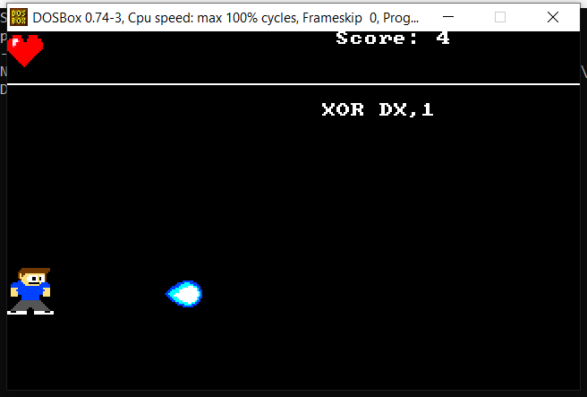

# The-good-Hany
A simple game to help differentiate between useful and useless lines of code in 8086 assembly language in a simple and fun way

## Who is Hany?

Hany was a fictional character used by our instructor in Microprocessors course mid-term and final exams. He was paid for the number of lines of code he wrote so he wrote many useless lines. In this game, Hany has changed and he is now attacking useless lines and leaving useful lines alone.

## Screenshot

